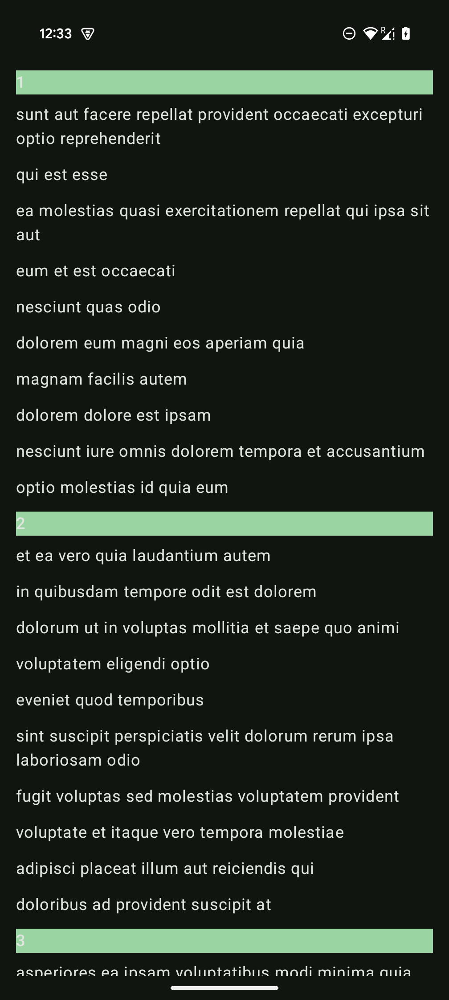

##Android project
- List screen
- Load data from remote API, which returns a list of Post(userId, id, title)
- Render the list on the screen using Compose, group `Post by userId`

##Detail screen
- UserId, Id, Title, Body
- Back button to go back to the previous screen

##Requirements:
- Use MVVM architectural pattern
- One activity + Composable functions
- Use Repository pattern for data loading
- Apply SOLID principles where you can
- Optional: Hilt, Modularization

##Expectations
- Create a skeleton/framework with all needed components, such as classes, interfaces, compose, etc…
- Add needed methods to components
- Code structure is important
- Error handling (toast message if error)
- Not much code smell

https://jsonplaceholder.typicode.com/posts
